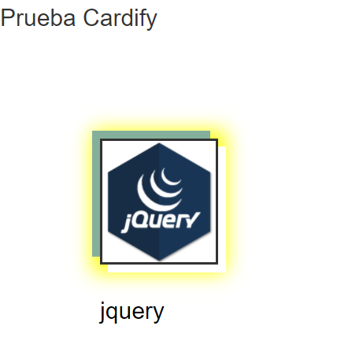
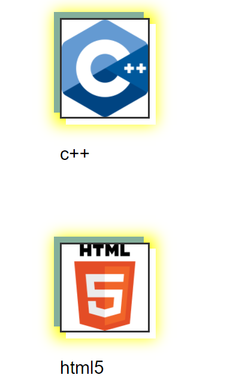
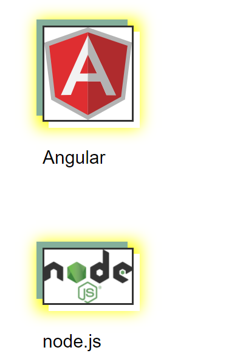

# Cardify

**Cardify** es un plugin de jQuery que dado un _contenedor_ debe buscar todas las imágenes que encuentre dentro del _contenedor_ y reemplazarlas por un nuevo elemento `<figure>` que contenga la imagen (``) además de un `<figcaption>` con el texto del atributo `alt` de la imagen.

## Flujo de trabajo


## Instalación

### Uso
1. **Creamos una estructura en el html5 para ir mostrando todas las imagenes que deseemos

```html
 <section class="example-container">
    <h2>Prueba Cardify</h2>
    
    
    
    
    
  </section>
```

## Uso
1. A traves de una funcion cardify llamaremos a nuestro plugin 
```js
//example-container es el selector del contenedor 
$('.example-container').cardify();
```
________________________________________________________________________________________________
2.Al llamar la funcion cardify automaticamente empieza a ejecutar el siguiente codigo
```js
$.fn.cardify = function() {
    $(this).find('img').each(function() {
      $(this).wrap('<figure></figure>');
      console.log('holi');
      $(this).parent().append('holi');
      $('figcaption').text('holi');
    });
```
3.Se mostrara las siguientes imagenes rellenadas en el contenedor


________________________________________________________________________________________________


________________________________________________________________________________________________


________________________________________________________________________________________________

**Puedes ir agregando Muchas imagenes mas**


## Ejemplos

...
